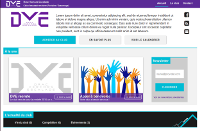
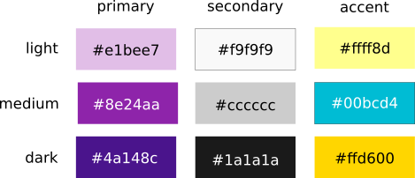

#  Site web du club Drac Vercors Escalade



[Version de développement](http://demo.dve-club.fr)

# Administration

## Articles

 Les champs suivants lors de la rédaction d'un nouvel article :

  - Titre : faites court
  - Chapô : phrase d'accroche
  - Contenu : apparaît après le libellé "Lire la suite"
  - Emplacement : la catégorie de l'article
  - Image d'accroche : utiliser `data/medias/news/default.png` par défaut

### Ajouter un album photos

 - uploader les images via la section `médias` dans un sous dossier de `albums` : ne pas oublier de créer des miniatures.
 - dans la sidebar de droite de l'édition d'articles, sélectionner l'album à lier à l'article via le menu déroulant `galerie`.

### Ajouter des fichiers

- uploader les fichiers via la section `médias` dans un sous dossier de `files`.

## Pages statiques

### Ajouter un lien vers une autre page statique

 - ajouter le code suivant en début de page

```php
<?php
global $plxShow;
function staticUrl($p_static_id)
{
  global $plxMotor;
  echo $plxMotor->urlRewrite('?static' . $p_static_id . '/' . $plxMotor->aStats[$p_static_id]['url']);
}
?>
```

 - créer un lien vers la page statique souhaitée :

```php
 <a href=<?php staticUrl('042') ?> >Lien vers la page statique 42</a>
```

# Services externes

## Statistiques d'utilisation

- Compte Google : caf.fontaine@gmail.com
- Adresse : [Google Analytics](https://analytics.google.com/analytics)

## Calendriers Google

- Compte Google : caf.fontaine@gmail.com
- Adresse : [Google Calendar](https://calendar.google.com)

## Newsletters

TODO

## Articles Facebook

  - Page Facebook: [Drac Vercors Escalade](https://fr-fr.facebook.com/Drac-Vercors-Escalade-160141077367724/)

Les [albums photos](https://www.facebook.com/Drac-Vercors-Escalade-160141077367724/photos/?tab=albums)
sont automatiquement importés et publiés sous forme d'article sur le site via [plx-fb-galery](https://github.com/crep4ever/plx-fb-gallery).
Ces articles sont associés à la catégorie `Facebook` et peuvent être modifiés depuis l'interface d'administration.
Les changements apportés depuis le site ne sont pas réperctutés sur la page Facebook.

# Description technique

## CMS

Ce site internet utilise [PluXml](http://www.pluxml.org) pour gérer son contenu (articles et pages statiques) avec les plugins suivants :

  - [artGalerie](http://thepoulpe.net/index.php?article3/demo-plugin-artgalerie) : gestion de galeries photos
  - [CKEditor](http://pluxopolis.net/myplugins) : éditeur de texte WYSIWYG pour la rédaction d'articles
 - [MyComSmilies](http://pluxopolis.net/myplugins): smileys dans les commentaires

Le thème PluXml dédié au club se trouve
dans le sous répertoire [themes/dve](https://github.com/crep4ever/dve/tree/master/themes/dve).

## Design

 - Palette de couleurs

Le thème du site utilise 9 couleurs définies en entête du [fichier css](https://github.com/crep4ever/dve/blob/master/themes/dve/css/theme.css.php).
Ces couleurs s'inspirent de la charte [Material Design](https://material.google.com/style/color.html#color-color-palette).

| Variable          | Couleur       | Code    |
| ----------------- |:-------------:| -------:|
| primary_light     | violet clair  | #e1bee7 |
| primary_medium    | violet moyen  | #8e24aa |
| primary_dark      | violet sombre | #4a148c |
| secondary_light   | gris clair    | #f2f2f2 |
| secondary_medium  | gris moyen    | #cccccc |
| secondary_dark    | gris sombre   | #1a1a1a |
| accent_light      | jaune clair   | #ffff8d |
| accent_medium     | bleu vif      | #00bcd4 |
| accent_dark       | jaune sombre  | #ffd600 |



 - Page template

 La page statique [template](data/statiques/006.theme.php) permet
 de prévisualiser la majorité du rendu des éléments html.

## Bibliothèques tierces

 - [font awesome](http://fontawesome.io) : jeu d'icônes css
 - [full calendar](http://fullcalendar.io/) : visualisation de calendriers
 - [jquery ui](https://jqueryui.com/) : widgets javascript

## Compatibilité

| Navigateur        | Version testée|
| ----------------- |:-------------:|
| Firefox           | 48            |
| Chrome            | 51            |
| Internet Explorer | -             |
| Safari            | -             |

| Largeur de page   | taille (px)   |
| ----------------- |:-------------:|
| petite            | < 768         |
| moyenne           | < 1024        |
| grande            | > 1024        |

## Sauvegarde et restauration

 Le contenu du site est situé dans le dossier [data](data/) :
 effectuer une copie de ce dossier avant toute mise à jour.

 Ce dossier est régulièrement synchronisé sur le [dépôt github](https://github.com/crep4ever/dve) qui permet
 de éventuellement d'en restaurer un version antiérieure.

## Resources de développement

 - [W3C validator](https://validator.w3.org/) : validation html
 - [DareBoost](https://www.dareboost.com) : analyse de performance
 - [Browser screenshots](https://developer.microsoft.com/en-us/microsoft-edge/tools/screenshots/) : compatibilité Internet Explorer
 - [CSS Minifier](http://cssminifier.com/) : optimisation css
